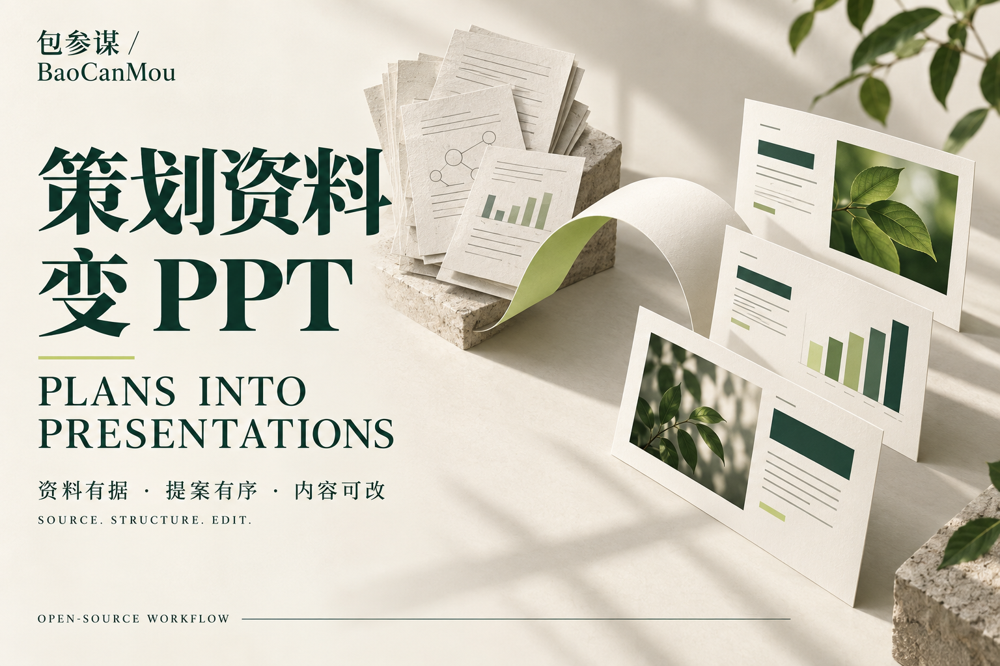

# BaoCanMou · Plans into Presentations

**Bring the materials. Explain the audience. Build a presentation people can understand and edit.**

[中文](README.md) · [Download](https://github.com/yht0912/baocanmou-plan-to-ppt/releases/latest) · [View the PDF](skills/baocanmou-plan-to-ppt/examples/山间来信_策划提案示范.pdf) · [Installation](docs/INSTALL.md)



An Agent Skill for planners, designers and brand teams. It turns briefs, meeting notes, research and tables into a sourced, structured presentation. Brand assignments use **MouShuMing®, the brand positioning and design model by Yi Huiting · BaoCanMou**, connecting positioning, design and communication.

This is an assistant workflow. Your host needs Skills support, file access, Python 3.10+ and a way to produce PPTX files. The scripts extract and check content; they do not include an AI model or a general PPTX generation engine.

## Inspect a real output file

The **12-slide Chinese deck for the fictional tea brand “山间来信” (Letters from the Mountains)** includes editable text, three native tables, one native chart with an embedded workbook, and two concept images. The brief, interviews and business numbers are fictional demonstrations.

[Download PPTX](skills/baocanmou-plan-to-ppt/examples/山间来信_策划提案示范.pptx) · [View PDF](skills/baocanmou-plan-to-ppt/examples/山间来信_策划提案示范.pdf) · [Source materials](skills/baocanmou-plan-to-ppt/examples/source) · [Slide plan](skills/baocanmou-plan-to-ppt/examples/plan.json)


An early budget of CNY 90,000 is explicitly replaced by a later confirmation of CNY 60,000. Missing vision inputs stay visibly unresolved. Mock interviews are labeled as such. Photographs and illustrations remain images. [Evidence and limits](docs/VALIDATION.md)

## Use it

After installation, give the assistant your materials:

> Use $baocanmou-plan-to-ppt to make an editable proposal for the brand owner. Apply MouShuMing to connect positioning, design, communication, budget and execution. Separate source claims from proposals. Mark missing inputs clearly. Use a clear, natural visual style.

For revisions:

> The budget has changed. Identify affected slides, then update the budget, execution recommendations and related tables. Preserve other approved pages.

| Need | Workflow |
|---|---|
| Conflicting documents | Record each source, conflict and resolution basis |
| Design disconnected from strategy | Link design to positioning and communication to that design |
| Misplaced numbers or categories | Bind values and labels to sources, then inspect the actual PPTX |
| A changed constraint | Identify direct dependencies and review indirect effects |
| A deck that stays editable | Create native text, tables and charts; inspect exported objects |

Checks validate computable relationships, not the truth of a source, commercial judgment or visual quality. Nonbrand reports and faithful formatting retain the requested scope.

## Install

```bash
git clone https://github.com/yht0912/baocanmou-plan-to-ppt.git
cd baocanmou-plan-to-ppt
python3 scripts/install_skill.py --host codex --dry-run
python3 scripts/install_skill.py --host codex
```

For Claude Code use `--host claude`. An intentional upgrade uses `--replace`; the installer preserves a backup outside the Skill discovery directory. A standalone Skill ZIP is also available. [Install, remove and roll back](docs/INSTALL.md)

The optional `render_artifact.mjs` adapter requires a host-provided proprietary Artifact Tool SDK. No SDK is distributed or offered for download. Other hosts must use their own PPTX tools. The complete sample is Chinese; an English deck and cross-host layout compatibility have not been validated.

## How MouShuMing applies

**Zhi is the values center; mission and vision guide Mou, Shu and Ming.** Mou addresses category, differentiation and proof. Shu turns positioning into design, language and experience. Ming carries the expression into audiences, channels, content, cadence and feedback. Three chapter labels alone do not establish the relationship.

Without assessment materials, a source card or founder input, produce a partial plan or explicit hypothesis. [English method guide](skills/baocanmou-plan-to-ppt/references/moushuming.en.md) · [English execution workflow](skills/baocanmou-plan-to-ppt/references/workflow.en.md)

## Development and credit

```bash
python3 scripts/verify_release.py
python3 scripts/build_release.py
```

[Contributing](CONTRIBUTING.md) · [Privacy](PRIVACY.md) · [Attribution](docs/ATTRIBUTION.md) · [Media kit](assets/README.md) · [Changelog](CHANGELOG.md)

Produced by **BaoCanMou**. Initiated and directed by **Yi Huiting**. Method: **MouShuMing® Brand Positioning and Design Model | Yi Huiting · BaoCanMou**. Code, documentation and demo production were AI assisted; this is not evidence of client endorsement, market performance or comparative superiority.

Generic workflow code and documentation use the [MIT license](LICENSE). The method summaries and pre-existing model assets have a separate scope. See [NOTICE](NOTICE.md) for method rights, generated images, brand identity and embedded fonts. The repository includes a Codex plugin manifest and a portable Skill; publication here does not mean official marketplace listing.

BaoCanMou — Design grounded in business. Position first, then design.  
[Website](https://www.bcmsj.com) · [Restaurant Slogans: Ten Lenses, Three Recommendations](https://github.com/yht0912/baocanmou-restaurant-slogan)
