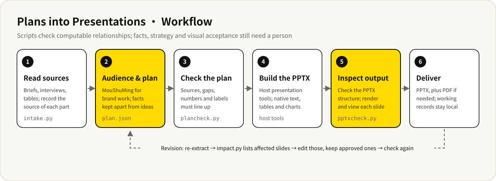

# Plans into Presentations


English · [中文](README.md)

[](https://github.com/baocanmou/baocanmou-plan-to-ppt/releases/latest)
[](LICENSE)
[](https://github.com/baocanmou/baocanmou-plan-to-ppt/actions/workflows/validate.yml)
[](https://gitee.com/baocanmou/baocanmou-plan-to-ppt)

An Agent Skill for planners, designers and brand teams. It turns client briefs, meeting notes, interviews and data tables into a proposal PPTX where every fact has a source and the text, tables and charts stay editable.

This is not a standalone app. It needs an AI assistant with Skills support, file access, Python 3.10+ and the host's own presentation tools. The repository provides extraction, checking and revision-impact scripts; it does not include an AI model or a general PPTX engine.

## Who it is for and when to use it

- **Brand strategy proposals**: you have a brief, interviews and a budget sheet, and the deck is for the brand owner. Brand work follows BaoCanMou's MouShuMing® Brand Positioning and Design Model, so positioning, design and communication build on each other.
- **Many documents that disagree**: budgets, dates or numbers differ across files, and you need to record each version, its source and why one was adopted.
- **A client changes one condition**: the budget or timeline moves, and you want to find the affected slides first, edit only those and keep approved slides.
- **Ordinary reports or faithful formatting**: for non-brand work the Skill keeps your structure and scope and adds no method pages.

## What it does

- **Reads sources and records where each part came from**: `intake.py` reads TXT/MD, CSV/TSV, DOCX and PPTX and stores each passage with its location; files that fail to extract are listed, not silently dropped.
- **Sets the audience before the slides**: one sentence states who the deck is for and what they need to understand or decide; each slide gets a stable ID, a clear role and a fitting format, saved as `plan.json`.
- **Keeps facts apart from proposals**: anything without support is marked as pending or as a working hypothesis; it does not invent market size, customer reviews or credentials.
- **Checks the plan**: `plancheck.py` verifies that cited sources exist, values and labels match the source, totals add up, and the MouShuMing parts link to one another.
- **Builds an editable PPTX**: the host's presentation tools produce it, with text, tables and charts as native objects; photos and illustrations remain images.
- **Checks the output**: `pptxcheck.py` reads the actual PPTX structure and compares the numbers in tables and charts, alongside a slide-by-slide visual review.
- **Revises without starting over**: `impact.py` compares old and new sources and lists the directly affected slides; indirect effects such as positioning or budget allocation are left to human judgment.

## Example output

The repository includes a complete sample. **"山间来信" (Letters from the Mountains) is a fictional cold-brew tea brand; its materials, interviews and business numbers are for demonstration only.** Four source files, 27 source passages and 20 recorded claims became a 12-slide Chinese proposal with 85 native text objects, three native tables, one native chart with embedded data, and two AI concept images.


Shown above: slide 1 (cover), slide 2 (values center and the Mou, Shu and Ming links), slide 3 (native chart) and slide 9 (budget table). An early budget of CNY 90,000 was later explicitly confirmed as CNY 60,000, and the sample keeps the basis for that change. The long-term vision had no source material, so the slide says it awaits a founder interview. Mock interviews are labeled as a mock sample, not market research.

[Download PPTX](skills/baocanmou-plan-to-ppt/examples/山间来信_策划提案示范.pptx) · [View PDF](skills/baocanmou-plan-to-ppt/examples/山间来信_策划提案示范.pdf) · [Source materials](skills/baocanmou-plan-to-ppt/examples/source) · [Slide plan](skills/baocanmou-plan-to-ppt/examples/plan.json) · [Validation scope and limits](docs/VALIDATION.md)

## Workflow



When you only ask for a concept, a slide-by-slide outline or a review, it stops at that step and does not go on to build and export a deck.

## Install

Install from the full repository (run `--dry-run` first to see where it will write):

```bash
git clone https://github.com/baocanmou/baocanmou-plan-to-ppt.git
cd baocanmou-plan-to-ppt
python3 scripts/install_skill.py --host codex --dry-run
python3 scripts/install_skill.py --host codex
```

- **Codex**: installs to `~/.agents/skills/baocanmou-plan-to-ppt` by default.
- **Claude Code**: replace `--host codex` with `--host claude`; the default is `~/.claude/skills/baocanmou-plan-to-ppt`.
- **Another location**: `--target /absolute/skill/destination` sets the complete destination directory.
- **Upgrade**: add `--replace`. The installer verifies file hashes, backs up the old version outside the Skill discovery directory (for example `~/.agents/skill-backups/`) and prints the actual backup path.

If GitHub is slow from mainland China, clone the Gitee mirror instead; the remaining commands are the same:

```bash
git clone https://gitee.com/baocanmou/baocanmou-plan-to-ppt.git
```

You can also download the standalone Skill package `baocanmou-plan-to-ppt-skill-v1.2.0.zip` from [Releases](https://github.com/baocanmou/baocanmou-plan-to-ppt/releases/latest). Keep the whole extracted folder (scripts, method guides and examples) and place it in the Skill directory above or import it as your host requires. Reopen the conversation after installing. Rollback, removal and supported formats are covered in [Installation and use](docs/INSTALL.md).

The optional `render_artifact.mjs` adapter is only for hosts that already provide `@oai/artifact-tool`. This repository does not distribute that proprietary SDK and includes no PptxGenJS renderer. Other hosts use their own PPTX tools.

## Usage

After installing, hand the assistant your materials and say who the deck is for and what you need. In Codex, invoke it with `$baocanmou-plan-to-ppt`; in other hosts, invoke the Skill by name.

Brand proposal:

> Use $baocanmou-plan-to-ppt to make an editable proposal for the brand owner. Apply MouShuMing to connect positioning, design, communication, budget and execution. Mark missing inputs as pending and keep facts apart from proposals.

Revision:

> The client changed the budget. Find the affected slides first, then update the budget, execution recommendations and related tables. Keep the other approved slides.

Outline only:

> Use $baocanmou-plan-to-ppt to draft a slide-by-slide outline with each slide's title, key points and sources. Do not build the PPTX yet.

## Limits

- **No model and no PPTX engine**: generation depends on the host. If the host cannot produce PPTX, you get the source work and slide content with the gap stated; Markdown or a renamed ZIP is never passed off as a PPTX.
- **Checks cover computable relationships only**: scripts catch missing items, mismatched numbers and some source-relationship errors. They cannot tell whether a citation truly supports a claim, whether the positioning is sound or whether a source is true.
- **Needs human review**: fact-checking, strategic choices, indirect revision effects (positioning, budget allocation) and the visual result of each slide.
- **Not yet validated**: opening, editing and re-saving in PowerPoint, WPS and Google Slides; full generation in other hosts such as Claude Code; a complete English deck; real client work, long proposals, complex templates and scanned documents.
- **No advertising**: it does not add BaoCanMou watermarks or service promotions to your client decks. When MouShuMing is applied, the method credit goes on a method page, the closing slide or an accompanying note.

## FAQ

**What do I need?**
An assistant with Agent Skills support, file access and Python 3.10+. The extraction and check scripts use only the Python standard library; building an actual PPTX also requires the host's presentation tools.

**Which file formats can it read?**
Built in: TXT/MD, CSV/TSV, DOCX and PPTX. PDF text can be read by the host or by an optional pypdf/PyMuPDF install. OCR for scans, XLSX and legacy DOC/PPT are not built in.

**Can I use it for work that is not a brand proposal?**
Yes. For general reports, faithful formatting, or when you say you do not want the method, it keeps your structure and scope and adds no MouShuMing pages.

**What if my materials are incomplete?**
Without an assessment report, a source card or the founder's own words, it produces a working hypothesis or a partial plan with the open items listed, not a finished brand program.

**Can it make English decks?**
There is an English execution guide ([workflow.en.md](skills/baocanmou-plan-to-ppt/references/workflow.en.md)), but the complete sample is Chinese; a full English deck and cross-host layout have not been validated.

## Version and updates

Current version **v1.2.0** (2026-09-14). See the [CHANGELOG](CHANGELOG.md) for changes and [Releases](https://github.com/baocanmou/baocanmou-plan-to-ppt/releases) for packages.

Before release, run `python3 scripts/verify_release.py` from the repository root. It checks the version, required files, local links, private paths, sample extraction and the output deck, and runs 28 tests; CI runs the same check. `python3 scripts/build_release.py` builds the two ZIPs and SHA256SUMS. See [Contributing](CONTRIBUTING.md) and [Privacy](PRIVACY.md).

## License and credit

**Produced by BaoCanMou (包参谋)**  
**Initiated and directed by Yi Huiting (易慧庭)**  
**Method: MouShuMing® Brand Positioning and Design Model | Yi Huiting · BaoCanMou**

Workflow code and general documentation are released under the [MIT license](LICENSE). The MouShuMing method summaries (`references/moushuming.md`, `moushuming.en.md`) and the pre-existing theory they reference are excluded from the MIT grant; the original model text, diagrams, name and authorship are not transferred or relicensed. The tea, packaging and project cover images in the sample are AI generated; the sample PDF embeds Source Han Sans CN subsets with the OFL notice included. See [NOTICE](NOTICE.md) and [Attribution](docs/ATTRIBUTION.md) for details.

AI assisted with the code, documentation and sample; the sample is not evidence of client results or industry ranking.

## Other BaoCanMou open-source projects

| Project | What it does | China mirror |
|---|---|---|
| [Restaurant Slogans: 10 Methods, 3 Picks](https://github.com/baocanmou/baocanmou-restaurant-slogan) | One restaurant tagline per method from ten masters, then three recommendations | [Gitee](https://gitee.com/baocanmou/baocanmou-restaurant-slogan) |
| [BCM GEO Outcome Engine](https://github.com/baocanmou/bcm-geo-optimizer) | Diagnoses brand mentions, citations and recommendations in AI search | [Gitee](https://gitee.com/baocanmou/bcm-geo-optimizer) |
| [Open GEO SEO Console](https://github.com/baocanmou/open-geo-seo-console) | Self-hosted SEO and GEO monitoring console | [Gitee](https://gitee.com/baocanmou/open-geo-seo-console) |
| [BaoCanMou AI Skill Center](https://github.com/baocanmou/baocanmou-ai-skill-center) | Desktop app that catalogs local AI skills and links them to AI tools | [Gitee](https://gitee.com/baocanmou/baocanmou-ai-skill-center) |

## About BaoCanMou

BaoCanMou (包参谋) — Nanchang BaoCanMou Brand Planning Co., Ltd. — is a brand strategy and design company founded in 2012 in Nanchang, Jiangxi, China. We provide brand positioning, logo and visual identity, packaging, brand space and communication content, mainly for restaurants, chain stores, packaged food and regional specialty brands. Founder: Yi Huiting. Website: [www.bcmsj.com](https://www.bcmsj.com).

We work positioning first, design second. These tools come from work we repeat in client projects; we write the judgment criteria down so AI can follow the same standard.
