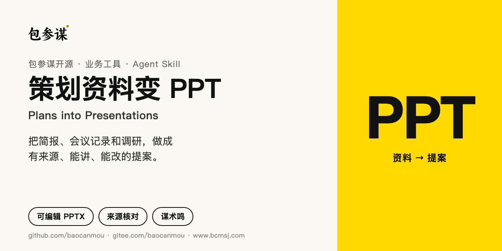
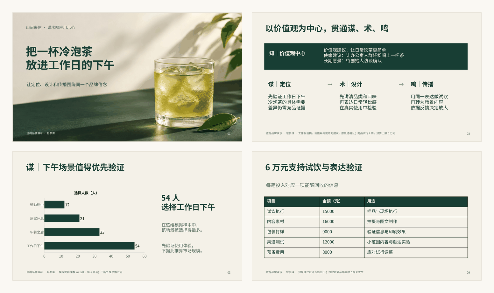
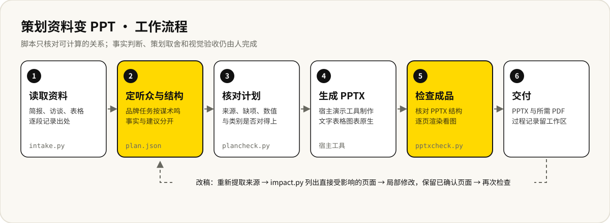

# 策划资料变 PPT



[English](README.en.md) · 中文

[](https://github.com/baocanmou/baocanmou-plan-to-ppt/releases/latest)
[](LICENSE)
[](https://github.com/baocanmou/baocanmou-plan-to-ppt/actions/workflows/validate.yml)
[](https://gitee.com/baocanmou/baocanmou-plan-to-ppt)

一个给策划、设计师和品牌团队用的 Agent Skill：把客户简报、会议记录、访谈和数据表，整理成每条事实都有出处、正文表格图表都能继续修改的提案 PPTX。

这不是双击运行的软件。它需要支持 Skills 的 AI 助手、文件读写、Python 3.10+，以及宿主自带的演示文稿制作能力。仓库提供提取、检查和改稿影响分析脚本，不包含 AI 模型或通用 PPTX 引擎。

## 适合谁、什么时候用

- **品牌策划提案**：手上有简报、访谈和预算表，要做给品牌负责人看的方案。品牌任务按包参谋的谋术鸣® 品牌定位设计模型，让定位、设计和传播前后承接。
- **资料多、说法不一致**：几份文件里的预算、时间或数字对不上，需要记下每种说法的出处和采用依据。
- **客户改了一个条件**：预算或周期变了，想先找出受影响的页面再局部修改，保留已经确认的页面。
- **普通汇报或按原稿排版**：不是品牌方案时，保留你给的结构和范围，不强加方法论页面。

## 能做什么

- **读资料并记出处**：`intake.py` 读取 TXT/MD、CSV/TSV、DOCX、PPTX，把每段内容记成带位置的来源；提取失败的文件单独列出，不悄悄漏掉。
- **先定听众，再排逐页内容**：开场一句话说清这份 PPT 要让谁理解或决定什么，每页有稳定 ID、明确作用和合适的表达方式，保存为 `plan.json`。
- **分开事实与建议**：没有资料支撑的内容标为待确认或工作假设，不生成虚构的市场规模、客户评价或资质。
- **核对计划**：`plancheck.py` 检查引用的来源是否存在、数值与类别是否和原资料一致、合计是否对得上、谋术鸣各部分是否相互关联。
- **生成可编辑 PPTX**：由宿主的演示文稿工具制作，正文、表格、数据图保持原生对象；照片和插画作为图片。
- **核对成品**：`pptxcheck.py` 读取实际 PPTX 的内部结构，核对表格和图表里的数字，再配合逐页渲染看图。
- **改稿不推倒重来**：`impact.py` 对比新旧来源，列出直接受影响的页面；定位、预算分配等间接影响交由人判断。

## 效果示例

仓库附一份完整示范：**“山间来信”是虚构的冷泡茶品牌，资料、访谈和经营数字都是演示用。** 4 份原始资料、27 段来源、20 条事实记录，做成 12 页中文提案，含 85 个原生文字对象、3 张原生表格、1 张带内嵌数据的原生图表和 2 张 AI 概念图。



上图依次为第 1 页封面、第 2 页价值观中心与谋术鸣关系、第 3 页原生图表、第 9 页预算表。资料里早期讨论过 9 万元预算，后来明确确认为 6 万元，示范保留了修订依据；长期愿景缺资料，页面上直接标“待创始人访谈确认”；模拟访谈注明是模拟样本，不冒充市场调研。

[下载 PPTX](skills/baocanmou-plan-to-ppt/examples/山间来信_策划提案示范.pptx) · [查看 PDF](skills/baocanmou-plan-to-ppt/examples/山间来信_策划提案示范.pdf) · [原始资料](skills/baocanmou-plan-to-ppt/examples/source) · [逐页计划](skills/baocanmou-plan-to-ppt/examples/plan.json) · [验证范围与限制](docs/VALIDATION.md)

## 工作流程



只要概念稿、逐页稿或评审意见时，做到对应步骤就交付，不会自行扩展到生成和导出。

## 安装

完整仓库安装（先用 `--dry-run` 看会写到哪里）：

```bash
git clone https://github.com/baocanmou/baocanmou-plan-to-ppt.git
cd baocanmou-plan-to-ppt
python3 scripts/install_skill.py --host codex --dry-run
python3 scripts/install_skill.py --host codex
```

- **Codex**：默认安装到 `~/.agents/skills/baocanmou-plan-to-ppt`。
- **Claude Code**：把 `--host codex` 换成 `--host claude`，默认安装到 `~/.claude/skills/baocanmou-plan-to-ppt`。
- **其他目录**：用 `--target /absolute/skill/destination` 指定完整目的目录。
- **升级**：加 `--replace`。安装器先校验文件哈希，再把旧版备份到技能扫描目录之外（例如 `~/.agents/skill-backups/`），并输出实际备份路径。

国内访问 GitHub 较慢时，可以从 Gitee 镜像克隆，其余命令相同：

```bash
git clone https://gitee.com/baocanmou/baocanmou-plan-to-ppt.git
```

也可以从 [Releases](https://github.com/baocanmou/baocanmou-plan-to-ppt/releases/latest) 下载独立 Skill 包 `baocanmou-plan-to-ppt-skill-v1.2.0.zip`，解压后保留整个文件夹（脚本、方法文档和示范都要在），放进上面的技能目录或按宿主要求导入。安装后重开会话。回滚、卸载和格式支持见 [安装与使用](docs/INSTALL.md)。

可选的 `render_artifact.mjs` 只在宿主已经提供 `@oai/artifact-tool` 时使用；本仓库不分发这个专有 SDK，也不附 PptxGenJS 渲染器。其他宿主使用自己的 PPTX 工具。

## 使用方法

安装后，把资料交给助手，直接说要给谁看、要做成什么。Codex 中用 `$baocanmou-plan-to-ppt` 调用，其他宿主按 Skill 名称调用。

品牌提案：

> 用 $baocanmou-plan-to-ppt，把这些资料做成给品牌负责人看的可编辑提案。按谋术鸣讲清定位、设计、传播、预算和执行。资料缺失就标待确认，事实和建议分开。

改稿：

> 客户把预算改了。先找受影响的页面，再更新预算、执行建议和相关表格，保留已确认的其他页面。

只要逐页稿：

> 用 $baocanmou-plan-to-ppt 先整理一份逐页稿，写清每页标题、要点和资料出处，暂时不用生成 PPTX。

## 边界

- **不含模型和 PPTX 引擎**：生成依赖宿主。宿主没有制作 PPTX 的能力时，先交付资料整理和逐页内容并说明缺口，不会把 Markdown 或改名的 ZIP 当成 PPTX。
- **检查只管可计算的关系**：脚本能发现缺项、数字错位和部分来源关系错误，不能判断引用是否真的支持观点、定位是否合理、原资料是否属实。
- **需要人工确认**：事实核查、策划取舍、改稿的间接影响（定位、预算分配等），以及逐页视觉效果。
- **尚未验证**：PowerPoint、WPS、Google Slides 中打开、修改、另存的表现；Claude Code 等其他宿主的完整生成；英文成套 PPT；真实客户、长提案、复杂模板和扫描件。
- **不加广告**：不会往你给客户的提案里放包参谋水印或服务推荐。应用谋术鸣时，在方法页、末页或随附说明保留方法署名。

## 常见问题

**需要什么环境？**
支持 Agent Skills 的助手、文件读写、Python 3.10+。提取和检查脚本只用 Python 标准库；生成实际 PPTX 还需要宿主的演示文稿工具。

**能读哪些格式？**
内置支持 TXT/MD、CSV/TSV、DOCX、PPTX。PDF 文本可以由宿主读取，或自行选装 pypdf/PyMuPDF。扫描件 OCR、XLSX、旧版 DOC/PPT 不在内置范围内。

**不是品牌方案也能用吗？**
可以。通用汇报、按原稿排版或你明确不要方法论时，保留原结构和范围，不加谋术鸣页面。

**资料不全怎么办？**
缺少评估报告、源力卡或创始人原话时，只形成工作假设或局部方案，并列出待补证、待确认事项，不会写成已完成的品牌全案。

**能做英文 PPT 吗？**
有英文执行说明（[workflow.en.md](skills/baocanmou-plan-to-ppt/references/workflow.en.md)），但完整示范是中文的，英文成套 PPT 和跨宿主排版尚未验证。

## 版本与更新

当前版本 **v1.2.0**（2026-09-14）。变更见 [CHANGELOG](CHANGELOG.md)，安装包见 [Releases](https://github.com/baocanmou/baocanmou-plan-to-ppt/releases)。

发布前在仓库根目录运行 `python3 scripts/verify_release.py`，检查版本、必要文件、相对链接、敏感路径、示范提取与成品，并跑 28 项测试；CI 运行同一检查。`python3 scripts/build_release.py` 生成两个 ZIP 和 SHA256SUMS。参与方式见 [贡献规范](CONTRIBUTING.md)，隐私说明见 [PRIVACY](PRIVACY.md)。

## 许可与署名

**出品：包参谋 / BaoCanMou**  
**发起与产品方向：易慧庭 / Yi Huiting**  
**方法依据：谋术鸣® 品牌定位设计模型｜易慧庭·包参谋**

工作流代码和通用文档按 [MIT](LICENSE) 开源。谋术鸣应用摘要（`references/moushuming.md`、`moushuming.en.md`）及其引用的原有理论内容不纳入 MIT 授权，模型原文、原图、名称与作者身份没有转让或重新许可。示范中的茶饮、包装和项目封面为 AI 生成图片；示范 PDF 嵌入 Source Han Sans CN 字体子集，附 OFL 许可。完整说明见 [NOTICE](NOTICE.md) 和 [署名说明](docs/ATTRIBUTION.md)。

示范不代表真实客户效果或行业排名。

## 包参谋其他开源项目

| 项目 | 做什么 | 国内镜像 |
|---|---|---|
| [餐饮广告语·十法三选](https://github.com/baocanmou/baocanmou-restaurant-slogan) | 按 10 种名家方法各写一条餐饮广告语，比较后推荐 3 条 | [Gitee](https://gitee.com/baocanmou/baocanmou-restaurant-slogan) |
| [GEO 效果优化](https://github.com/baocanmou/bcm-geo-optimizer) | 诊断品牌在 AI 搜索中的提及、引用和推荐，按证据排改进任务 | [Gitee](https://gitee.com/baocanmou/bcm-geo-optimizer) |
| [Open GEO SEO Console](https://github.com/baocanmou/open-geo-seo-console) | 可自行部署的 SEO 与 GEO 监控后台 | [Gitee](https://gitee.com/baocanmou/open-geo-seo-console) |
| [包参谋 AI 技能中心](https://github.com/baocanmou/baocanmou-ai-skill-center) | 盘点本机 AI Skill 并统一连接多种 AI 工具的桌面应用 | [Gitee](https://gitee.com/baocanmou/baocanmou-ai-skill-center) |

## 关于包参谋

包参谋，全称南昌包参谋品牌策划有限公司，2012 年创立于江西南昌，提供品牌定位、Logo/VI 设计、包装设计、品牌空间与传播内容服务，主要服务餐饮、连锁门店、食品快消和地方特色品牌。创始人易慧庭。官网：[www.bcmsj.com](https://www.bcmsj.com)。

我们先定位，后设计。这些开源工具来自我们在实际项目里反复做的工作，我们把判断标准写清楚，让 AI 按同样的标准做事。
