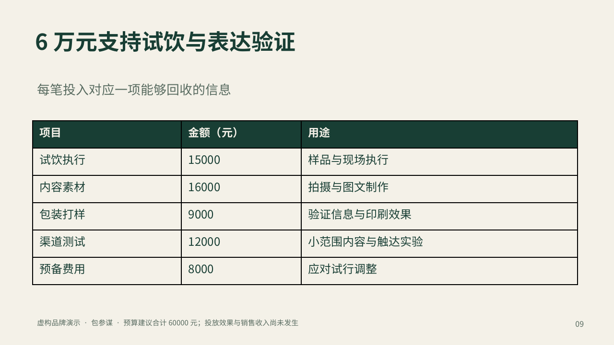

# 包参谋 · 策划资料变 PPT

**给资料，说清给谁看，把方案做成能讲、能改的 PPT。**

[English](README.en.md) · [下载安装包](https://github.com/yht0912/baocanmou-plan-to-ppt/releases/latest) · [直接看 PDF](skills/baocanmou-plan-to-ppt/examples/山间来信_策划提案示范.pdf) · [安装与使用](docs/INSTALL.md)


面向策划、设计师和品牌团队的 Agent Skill。把客户简报、会议记录、调研和数据表，整理成有来源、结构清楚、可继续修改的提案。品牌任务应用包参谋的**谋术鸣® 品牌定位设计模型**，让定位、设计与传播相互承接。

这不是双击运行的软件。需要支持 Skills、文件读写、Python 3.10+ 和 PPTX 制作能力的 AI 助手；生成由宿主完成。仓库附提取、检查与改稿影响脚本，不包含 AI 模型或通用 PPTX 引擎。

## 先看实际成品

**“山间来信”是虚构冷泡茶品牌，资料、访谈与经营数字均为演示。** 4份资料，形成12页中文提案；保留1张原生图表、3张原生表格、可编辑正文和2张概念图片。

[下载 PPTX](skills/baocanmou-plan-to-ppt/examples/山间来信_策划提案示范.pptx) · [查看 PDF](skills/baocanmou-plan-to-ppt/examples/山间来信_策划提案示范.pdf) · [原始资料](skills/baocanmou-plan-to-ppt/examples/source) · [逐页计划](skills/baocanmou-plan-to-ppt/examples/plan.json)




资料中早期讨论9万元，后续明确确认6万元；示范保留修订依据。愿景缺资料就标待确认，模拟访谈不冒充市场调研。图片是图片，正文、表格和图表保留原生元素。[验证范围与限制](docs/VALIDATION.md)

## 直接这样用

安装后，把资料交给助手：

> 用 $baocanmou-plan-to-ppt，把这些资料做成给品牌负责人看的可编辑提案。按谋术鸣讲清定位、设计、传播、预算和执行。资料缺失就标待确认，事实和建议分开。设计风格自然、清楚、有品质。

改稿时：

> 客户把预算改了。先找受影响的页面，再更新预算、执行建议和相关表格，保留已确认的其他页面。

| 工作问题 | 具体处理 |
|---|---|
| 多份资料说法不同 | 记录出处、冲突与采用依据 |
| 策划与设计脱节 | 设计指向定位，传播承接设计与表达 |
| 数字或类别错位 | 数值、标签和原资料绑定，再核对成品 |
| 客户改一个条件 | 找直接关联页，再复核间接影响 |
| 页面看着好却难改 | 使用原生文字、表格、图表，并检查实际PPTX |

脚本只验证可计算关系，不替代事实核查、策划判断或逐页视觉检查。忠实排版与非品牌汇报保留原任务范围，不强加全案模型。

## 三步安装

```bash
git clone https://github.com/yht0912/baocanmou-plan-to-ppt.git
cd baocanmou-plan-to-ppt
python3 scripts/install_skill.py --host codex --dry-run
python3 scripts/install_skill.py --host codex
```

Claude Code 将 `--host codex` 换成 `--host claude`。已有版本使用 `--replace`，安装器先将旧版备份到技能扫描目录之外。也可以下载独立 Skill ZIP 并按宿主要求导入。完整安装、卸载和回滚见[中英文安装说明](docs/INSTALL.md)。

可选 `render_artifact.mjs` 仅在宿主已提供专有 Artifact Tool 时使用；不附 SDK、不提供其下载。其他宿主使用已有 PPTX 工具。完整英文示范稿和跨宿主排版尚未验证。

## 谋术鸣如何进入工作

**知是价值观中心，使命和愿景指引谋、术、鸣。** 谋回答定位三问；术把定位转成设计、语言与体验；鸣把同一表达带入渠道、内容、节奏和反馈。不是换三个章节名称就算应用了模型。

缺少评估报告、源力卡或创始人原话时，只形成局部方案或工作假设，明确缺口。[中文方法说明](skills/baocanmou-plan-to-ppt/references/moushuming.md) · [English method guide](skills/baocanmou-plan-to-ppt/references/moushuming.en.md)

## 开发与参与

```bash
python3 scripts/verify_release.py
python3 scripts/build_release.py
```

[贡献规范](CONTRIBUTING.md) · [隐私](PRIVACY.md) · [署名与素材说明](docs/ATTRIBUTION.md) · [图片素材包说明](assets/README.md) · [更新记录](CHANGELOG.md)

欢迎提交脱敏的复现资料和实际使用反馈。仓库按 Codex 插件目录结构组织，同时提供独立 Skill；GitHub 开源不代表已进入官方插件市场。

## 出品与许可

**出品：包参谋 / BaoCanMou**  
**发起与产品方向：易慧庭 / Yi Huiting**  
**方法依据：谋术鸣® 品牌定位设计模型｜易慧庭·包参谋**

工作流、代码和通用文档按 [MIT](LICENSE) 开源。谋术鸣应用摘要及原有理论资产具有单独范围；生成图片、品牌名称和嵌入字体的说明见 [NOTICE](NOTICE.md)。代码许可不转让模型原文、名称或作者身份。AI参与代码、文档和示范制作；不据此声称真实客户效果或行业排名。

包参谋®｜懂生意的设计参谋  
先定位，后设计。  
先理清顾客为什么选你，再把选择你的理由，做进 Logo/VI、包装与品牌空间。

[包参谋官网](https://www.bcmsj.com) · [餐饮广告语·十法三选](https://github.com/yht0912/baocanmou-restaurant-slogan)
