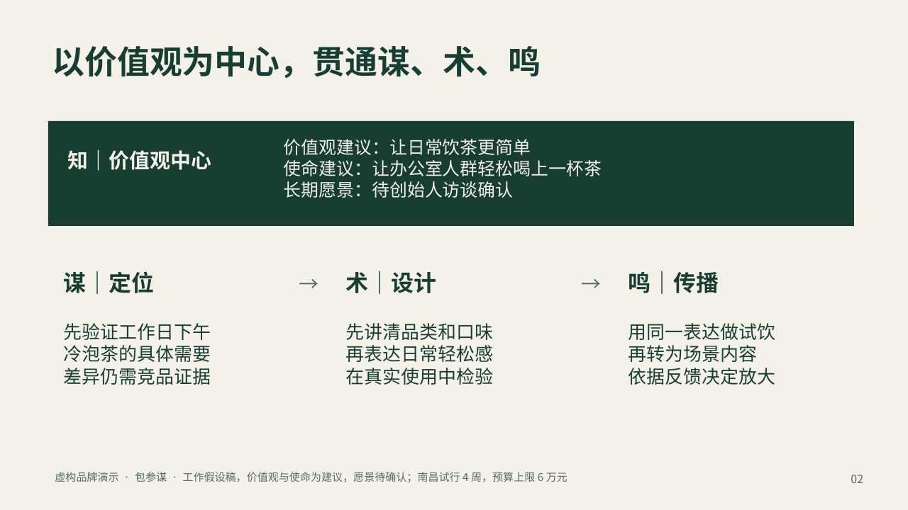

# 包参谋 · 策划资料变 PPT

把客户简报、会议记录、调研和数据表，整理成一份能讲清方案、能继续修改的提案 PPT。

**v1.2.0 开源版：以包参谋「谋术鸣®」为品牌策划依据。** 知是价值观中心：明确使命和愿景；谋确定定位，术把定位变成设计与表达，鸣通过渠道、内容和节奏形成用户回应。[查看方法应用](references/moushuming.md)

**给资料，说清给谁看，AI 完成整理、设计和检查。**


[下载示范 PPTX](examples/山间来信_策划提案示范.pptx) · [看 PDF](examples/山间来信_策划提案示范.pdf) · [查看原始资料](examples/source) · [查看测试范围](docs/验证说明.md)

## 直接这样用

把本目录安装到支持 Agent Skills 的 AI 助手，再交给它资料：

> 用“策划资料变 PPT”，按包参谋谋术鸣体系，把这些资料做成给品牌负责人看的提案。我要能修改的 PPT，讲清定位、设计、传播、预算和执行。价值观和愿景缺资料就标待确认，不要编造。设计风格自然、清楚、有品质。

改稿时可以说：

> 客户把预算改了。先找出受影响的页面，再更新预算、执行建议和相关表格。已确认的其他页面保持原样。

需要 AI 助手具有**文件读写、Python 和 PPTX 制作能力**。这是供助手使用的 Skill，不是双击运行的软件；Python 脚本本身不包含 AI 模型。没有 PPTX 工具的环境只能先整理逐页内容，不能直接得到成品。

## 它具体做什么

| 你遇到的事 | Skill 的处理 |
|---|---|
| 客户给了几份杂乱资料 | 先理清听众、关键问题、事实和建议，再安排每一页 |
| 方案只有漂亮页面，看不出策划逻辑 | 让每项设计对应一条定位，让传播承接同一套表达；缺关联时提示补全 |
| 简报和会议纪要的预算不同 | 记录差异和采用依据，不自动以文件新旧判定 |
| 图表数字抄错或类别错位 | 将数字和类别绑定到原资料，检查对应关系 |
| AI 做的 PPT 很难改 | 正文、表格和数据图使用原生元素，照片作为图片 |
| 客户修改一个条件，整套都乱了 | 找直接关联页，再由助手检查连带影响并修改 |
| 看上去不错，却没有验收 | 核对实际 PPTX 内容，再逐页检查渲染效果 |

来源绑定帮助发现错误，不能代替事实和语义审核。局部改稿脚本负责找页面，实际修改由助手完成。

## 安装

解压后保留整个 `baocanmou-plan-to-ppt` 文件夹，不能只复制 SKILL.md。

- Codex：放入 `~/.agents/skills/baocanmou-plan-to-ppt/`。
- Claude Code：放入 `~/.claude/skills/baocanmou-plan-to-ppt/`。
- 其他支持 Agent Skills 的助手：使用其技能导入功能，按该宿主的要求安装。

已有同名版本时先将备份移到技能扫描目录之外，再替换。重新打开会话后，通过名称或 `$baocanmou-plan-to-ppt` 调用。不同宿主的发现机制与 PPTX 工具不同，本版不声称已经逐一测试。



## 示例与运行边界

示范是虚构冷泡茶品牌“山间来信”：4份资料 → 12页谋术鸣应用方案，含价值观中心与三模块总览、定位三问、设计任务、传播安排，保留1张原生图表、3张原生表格和2张概念图片。资料不具备完整全案输入，因此明确作为工作假设稿；使命与价值观为建议，愿景待访谈确认。

脚本直接读取 UTF-8 TXT/Markdown、CSV/TSV、DOCX 正文与表格、PPTX 文本；PDF 文字提取需要 PyMuPDF、pypdf 或宿主 PDF 工具。扫描件、图内文字、合并单元格和复杂修订由宿主另行读取。旧版 `.doc`、`.ppt` 与 Excel 并非内置解析格式，可由宿主处理或先导出。

可编辑是指文字、表格和图表数据；摄影、插画与包装概念图仍然是图片。示范使用 Source Han Sans CN，本包不附独立字体文件，PDF嵌入子集的许可见NOTICE，换电脑需检查字体替换。

`scripts/render_artifact.mjs` 是可选的 Codex 宿主适配器，依赖宿主已提供的专有 Artifact Tool；本包**不包含该 SDK，也不提供它的安装下载**。其他宿主应调用自己已有的 PPTX 制作工具。详见 [运行说明](references/rendering.md)。

## 开发者复查

在本目录运行：

```bash
python3 scripts/intake.py examples/source/* --out /tmp/bcm-sources.json
python3 scripts/plancheck.py examples/plan.json --sources /tmp/bcm-sources.json
python3 scripts/pptxcheck.py examples/山间来信_策划提案示范.pptx --plan examples/plan.json
python3 -B -m unittest discover -s tests -v
```

基础检查使用 Python 标准库。没有后台上传、遥测或自动调用付费 API；助手生成图片、联网或使用付费服务时，遵守用户与宿主的授权。

## 关于包参谋

包参谋将策划、运营与设计中的工作方法，做成能够实际使用和复查的工具。本 Skill 的目标是把资料变成清楚的方案，把方案变成可继续协作的交付。

作者身份保留在项目说明与示范中；应用谋术鸣时在方法页、末页或随附说明保留方法署名，不强制加广告或逐页水印。欢迎提交脱敏的问题案例和改进建议。工作流代码与通用说明按 MIT 许可提供，谋术鸣原有理论资产及素材范围见 [NOTICE](NOTICE.md)。

[English project guide](https://github.com/yht0912/baocanmou-plan-to-ppt/blob/main/README.en.md) · [English execution](references/workflow.en.md)
